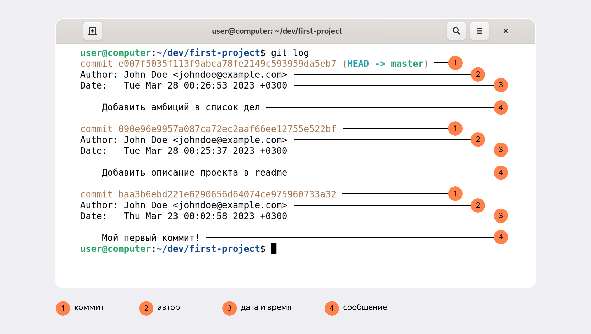
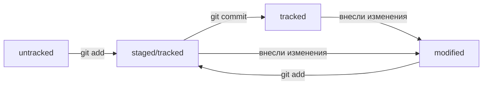

# Проект "Git commands for juniors"
Этот проект предназначен для изучения информации о командах Git, для того что бы любой новичок мог быстро и оперативно изучить базовые команды.

---

## Что такое Git и в чём его польза

Система контроля версий, или VCS, — это программное обеспечение, которое помогает отслеживать изменения в программах, текстовых файлах, больших документах, веб-сайтах и так далее. 

Одно изменение или группу изменений в VCS называют ревизией или версией. Каждая такая ревизия содержит информацию о том, что изменилось, кто внёс изменения, когда это было и иногда комментарии к изменению.

Одна из ключевых особенностей современных систем контроля версий — поддержка параллельной работы нескольких пользователей, в том числе над одним файлом. Именно поэтому VCS так популярны у разработчиков.

Система контроля версий — общее название ряда продуктов, таких как Git, Mercurial, Subversion и других. В этом проекте описан самый популярный из них — Git.

Git стал незаменимым инструментом в командной работе именно благодаря возможности сохранять и «склеивать» труд разных программистов. Большинство работодателей ожидают, что разработчик понимает, зачем нужна система контроля версий, и умеет её использовать.

## Зачем нужна командная строка

Командная строка — один из основных инструментов взаимодействия с компьютером. Командная строка (англ. Command-line Interface, или CLI) — это интерфейс, только текстовый. Пользователь вводит в неё команды. Она принимает их от пользователя и выполняет. Эта строка — обычная программа на вашем компьютере. Такая же, как, например, браузер.  
Командную строку часто называют терминалом или консолью.  
Git — это программа, которая в том числе может работать из командной строки. Любой графический интерфейс для Git всего лишь преобразует клики пользователя в вызовы программы.
Команда может вообще не принимать параметры, а может принимать один или несколько параметров.
Для выполнения любой команды нужно нажать кнопку __Enter__ . 


--- 

## Команды Git

### 1. pwd 
Узнать, где вы сейчас, поможет команда pwd (от англ. print working directory — «показать рабочую папку»). Она выводит путь к текущей директории.
Командная строка выведет путь к папке, в которой вы сейчас находитесь.
Команда не имеет параметров  
_Пример команды:_
```
pwd
```

### 2. cd 
Это команда для смены текущей директории. Она меняет текущую рабочую директорию на ту, которая указана в качестве параметра. Для того чтобы сменить текущую директорию нужно ввести команду __cd__ (от англ. change directory — «сменить директорию») и указать расположение папки в которую хотите перейти.

_Пример команды для перехода в домашнюю директорию:_
```
cd ~
```

Допустим, вы находитесь в директории /projects. Если ввести команду cd github, она перенесёт вас в директорию /projects/github.

Обратите внимание: если в названии папки есть пробелы, при вводе нужно использовать кавычки.

```
cd "Фотографии с дня рождения"
```

Чтобы вернуться в родительскую директорию — то есть на уровень выше, — вместо названия папки нужно написать две точки: ..

```
cd ..
```

Есть ещё одна команда с точкой. Чтобы обратиться к текущей директории, можно использовать .

```
cd . 
```

### 3. ls 
Для отображения файлов и папок используют команду — ls (от англ. list directory contents — «отобразить содержимое директории»).  
Команда не имеет параметров


_Пример команды:_
```
ls
```
У многих команд консоли есть дополнительные опции. Например, если вы вызовете ls, то увидите список обычных файлов в директории. Но можно вызвать ls с флагом -a и вывести расширенный список. В нём отобразятся все скрытые файлы, которые начинаются с символа . (например, файлы конфигурации). В том числе два особых файла . и .., которые обозначают текущую и родительскую директории.

```
ls -a
```

А ещё, как и другие команды, ls может работать с символом домашней директории (~) и предыдущей директории (..). Например, ls ~ выведет содержимое домашней директории вне зависимости от того, что показывает pwd. А ls .. покажет содержимое родительской директории.

### Остальные команды ниже приведены в виде списка:

* Чтобы создать файл, нужно ввести в консоль команду touch (англ. «коснуться») с именем файла в качестве параметра: touch %ИМЯ_ФАЙЛА%.
```
touch my-new-file.txt
```
* Для создания директорий через терминал используют другую команду — mkdir (от англ. make directory — «создать директорию»).
```
mkdir new-dir
```
* Для копирования файлов через терминал существует команда cp (от англ. copy — «копировать»). В простом виде cp принимает два параметра: что копируем и куда копируем.
```
cp что_копируем куда_копируем
```
* Перемещение файлов и папок — mv Синтаксис команды mv аналогичен синтаксису cp. После имени команды указывают список файлов и папок, которые нужно переместить, а затем — папку, в которую нужно выполнить перемещение.
```
mv table.csv ./very-important-files
```
---
## Хеш, лог и HEAD

### Хеш — идентификатор коммита

Хеширование (от англ. hash, «рубить», «крошить», «мешанина») — это способ преобразовать набор данных и получить их «отпечаток» (англ. fingerprint).

Информация о коммите — это набор данных: когда был сделан коммит, содержимое файлов в репозитории на момент коммита и ссылка на предыдущий, или родительский (англ. parent), коммит. Git хеширует (преобразует) эту информацию с помощью алгоритма SHA-1 (от англ. Secure Hash Algorithm — «безопасный алгоритм хеширования») и получает для каждого коммита свой уникальный хеш — результат хеширования.

Хеш обладает следующими важными свойствами:
* если хеш получить дважды для одного и того же набора входных данных, то результат будет гарантированно одинаковый;
* если хоть что-то в исходных данных поменяется (хотя бы один символ), то хеш тоже изменится (причём сильно).

Git хранит таблицу соответствий хеш → информация о коммите. Если вы знаете хеш, вы можете узнать всё остальное: автора и дату коммита и содержимое закоммиченных файлов. Можно сказать, что хеш — основной идентификатор коммита.

### Исследуем лог
После вызова git log появляется список коммитов с их описанием.



Вот из каких элементов состоит описание:
1. Строка из цифр и латинских букв после слова commit — это уже знакомый вам хеш коммита.
2. Author — имя автора и его электронная почта.
3. Date — дата и время создания коммита.
4. Сообщение к коммиту.

### HEAD — всему голова

Файл HEAD (англ. «голова», «головной») — один из служебных файлов папки .git. Он указывает на коммит, который сделан последним (то есть на самый новый).

Внутри HEAD — ссылка на служебный файл: refs/heads/master (или refs/heads/main в зависимости от названия ветки). Если заглянуть в этот файл, можно увидеть хеш последнего коммита.

Когда вы делаете коммит, Git обновляет refs/heads/master — записывает в него хеш последнего коммита. Получается, что HEAD тоже обновляется, так как ссылается на refs/heads/master.

---

## Cтатусы файлов и как читать git status

Одна из ключевых задач Git — отслеживать изменения файлов в репозитории.
--

Для этого каждый файл помечается каким-либо статусом. Рассмотрим основные.
* untracked (англ. «неотслеживаемый»)

Новые файлы в Git-репозитории помечаются как untracked, то есть неотслеживаемые. Git «видит», что такой файл существует, но не следит за изменениями в нём. У untracked-файла нет предыдущих версий, зафиксированных в коммитах или через команду git add.

* staged (англ. «подготовленный»)

После выполнения команды git add файл попадает в staging area (от англ. stage — «сцена», «этап [процесса]» и area — «область»), то есть в список файлов, которые войдут в коммит. В этот момент файл находится в состоянии staged.


Staging area также называют index (англ. «каталог») или cache (англ. «кеш»), а состояние файла staged иногда называют indexed или cached. Все три варианта могут встречаться в документации и в качестве флагов команд Git. А также в интернете — например, в вопросах и ответах на сайте Stack Overflow.

* tracked (англ. «отслеживаемый»)

Состояние tracked — это противоположность untracked. Оно довольно широкое по смыслу: в него попадают файлы, которые уже были зафиксированы с помощью git commit, а также файлы, которые были добавлены в staging area командой git add. То есть все файлы, в которых Git так или иначе отслеживает изменения.

* modified (англ. «изменённый»)

Состояние modified значит, что Git сравнил содержимое файла с последней сохранённой версией и нашёл отличия. Например, файл был закоммичен и после этого изменён.

Вот что ещё важно учесть:

* Для файлов в состояниях staged и modified обычно не указывается, что они также tracked, потому что это состояние подразумевается.

* Команда git add добавляет в staging area только текущее содержимое файла. Если вы, например, сделаете git add file.txt, а затем измените file.txt, то новое содержимое файла не будет находиться в staging. Git сообщит об этом с помощью статуса modified: файл изменён относительно той версии, которая уже в staging. Чтобы добавить в staging последнюю версию, нужно выполнить git add file.txt ещё раз.



---
## Оформление сообщений к коммитам

### Зачем вообще писать сообщения
Сообщения коммитов можно сравнить с надписями на коробках в кладовке. Если надписей нет, то нужную коробку будет сложно найти: придётся заглянуть в каждую, чтобы понять, что там. А если надписи есть, то нужная найдётся сразу.

Как и надпись на коробке, сообщение коммита должно помочь определить, что внутри. Например, надпись на коробке «всякое разное» не очень полезная. Сообщение коммита «небольшие исправления» тоже: непонятно, что было исправлено в таком коммите и зачем.

Есть общие рекомендации по тому, как правильно составить сообщение. Оно должно быть:
* относительно коротким, чтобы его было легко прочитать;
* информативным.

### Стили оформления

Все люди разные и у всех есть предпочтения — в том числе, как формулировать сообщения коммитов. Кто-то использует инфинитивы: **_Исправить сообщение об ошибке E123_**, кто-то — глаголы в прошедшем времени: **_Исправил…_**, кто-то — существительные: **_Исправление…_**.

Без единообразия коммитов нет и эффективной работы в Git. Это может показаться мелочью, но когда коммиты с сообщениями в разных стилях идут друг за другом, их может быть сложно читать.
Чтобы упростить работу, команды или даже целые компании часто договариваются об определённом стиле (то есть о правилах) оформления сообщений коммитов.

Есть много подходов к оформлению сообщений коммитов, но мы расскажем о нескольких популярных. Их используют как отдельные команды, так и целые проекты.

**Корпоративный**

Во многих компаниях применяется Jira — система для организации проектов и задач. У каждой задачи в Jira есть идентификатор из нескольких заглавных латинских букв и номера. Например, LGS-239 значит, что это
239-я задача в проекте LGS (сокращение от англ. logistics — «логистика»).

В корпоративном стиле в начале сообщения обычно указывают Jira-ID, а после — текст сообщения.

````
$ git commit -m "LGS-239: Дополнить список пасхалок новыми числами" 
````

**Conventional Commits**

Стандарт Conventional Commits (англ. «соглашение о коммитах») отличается качественной документацией и подробной проработкой. Он подходит для репозиториев с исходным кодом программ. А вот использовать его для других типов проектов было бы неудобно.

Conventional Commits предлагает такой формат коммита: 
```
<type>: <сообщение>. 
```

Первая часть type — это тип изменений. Таких типов достаточно много. Вот два примера:
* feat (сокращение от англ. feature) — для новой функциональности;
* fix (от англ. «исправить», «устранить») — для исправленных ошибок.

````
git commit -m "feat: добавить подсчёт суммы заказов за неделю" 
````

**GitHub-стиль**

GitHub можно использовать не только для хранения файлов проекта, но и для ведения списка задач (англ. issue) этого проекта. Если коммит «закрывает» или «решает» какую-то задачу, то в его сообщении удобно указывать ссылку на неё. Для этого в любом месте сообщения нужно указать #<номер задачи>. Например, вот так.

````
$ git commit -m "Исправить #334, добавить график температуры"  
````
В таком случае GitHub свяжет коммит и задачу.